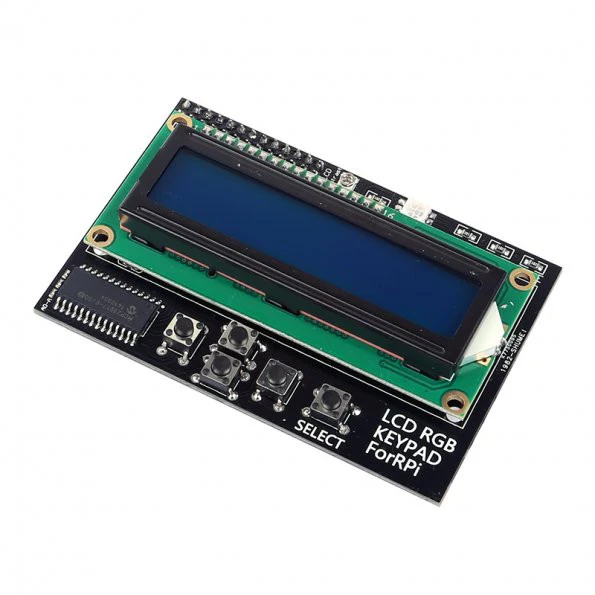

# MCP23017 and RGB1602 LCD with Raspberry Pi

This project demonstrates how to use the **MCP23017 I/O expander** to control an **RGB1602 LCD** with a **Raspberry Pi**. The MCP23017 communicates with the Raspberry Pi via the **I2C protocol**, providing additional GPIO pins to control the LCD, Backlight and RGB LED.

More details:

- The Raspberry Pi has a limited number of GPIO pins. The MCP23017 adds 16 more.
- The MCP23017 uses only 2 pins (SDA and SCL) for I2C communication, saving GPIO pins on the Raspberry Pi.

## Background

At some point, I bought this particular accessory for the Raspberry Pi.

Features
* I2C Interface (Address: 0x20)
* LCD 16x2 Characters
* 5 Buttons
* 1 RGB LED
* Uses MCP23017

I'm sure I had the same issue where the device is similar to [one from Adafruit](https://learn.adafruit.com/adafruit-16x2-character-lcd-plus-keypad-for-raspberry-pi) but the backlight functionality is different.

TLDR, I managed to get the backlight working.

## Credits

Most of the code is based on the https://github.com/adafruit/Adafruit_CircuitPython_CharLCD
